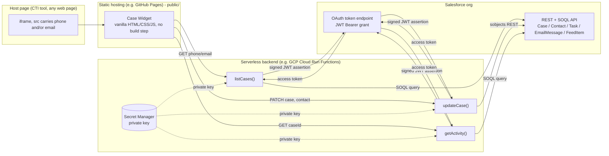
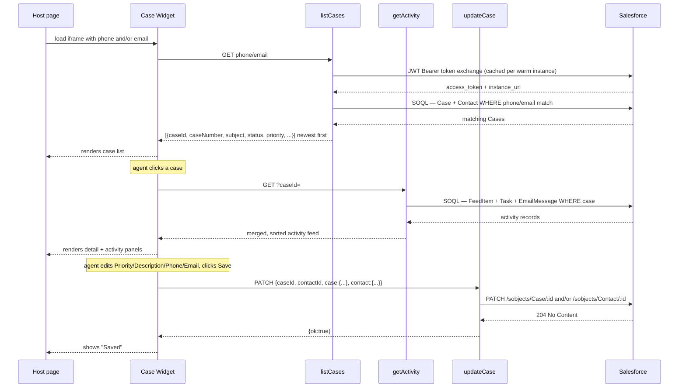

# Salesforce Case Widget — Architecture & Rebuild Guide

This document explains **what** this widget is, **why** it's built the way it is,
and **how** to rebuild or extend it against a different Salesforce org, GCP
project, or GitHub account. It's written for another UJET SC who needs to stand
this up from scratch, not just re-read the setup checklist.

For day-to-day setup commands scoped to one specific deployment, see
[README.md](README.md). This document is the generalized, "why does it work
this way, and how do I adapt it" reference.

> **Worked example used throughout**: this widget was originally built and
> deployed against Salesforce org `ujet89-dev-ed.my.salesforce.com`, GCP
> project `ujet-demo-credit-9gde`, and GitHub repo
> [adammak-ujet/ccaas-salesforce-case-widget](https://github.com/adammak-ujet/ccaas-salesforce-case-widget).
> Every command below is written generically with `<placeholders>` — swap in
> your own org/project/repo. No credentials or secret values appear in this
> document; get those from your own Salesforce/GCP setup (see the Rebuild
> Guide below).

---

## 1. Problem this solves

A CTI/CCaaS screen-pop tool (or any web page) often needs to show an agent
"what's the Salesforce Case history for this caller" without a full native
Salesforce integration. This widget is a small, self-contained, brandable
iframe that:

- Looks up every Case tied to a phone number or email (not just one)
- Lets the agent pick which Case they're working, newest first
- Shows a curated subset of Case fields, editable with real write-back
- Shows a merged activity feed (Chatter posts, Tasks, Emails) with refresh
- Costs close to nothing to host (static site + a few serverless functions)

It deliberately avoids requiring the host page to run any Salesforce SDK or
hold any Salesforce credentials — the iframe is the entire integration
surface.

---

## 2. Why this shape (design rationale)

**Static frontend + serverless backend, not a single server.** Salesforce
OAuth credentials (a private key, in this case) can never live in
browser-loaded JavaScript — anyone can view-source a public site. So the
widget itself is 100% static (deployable to GitHub Pages, or literally any
static host), and a thin backend holds the credentials and proxies
Salesforce REST/SOQL calls. This mirrors the same principle the sibling
`web-sdk-demo` project in this repo uses for signing UJET JWTs server-side.

**Three separate functions, not one Express app.** Google Cloud Run
Functions (2nd-gen Cloud Functions) are one-HTTP-trigger-per-function, with
no built-in path router across functions — unlike a Cloud Run *service*
running Express, where you'd get one URL and route by path yourself. Given
the small number of operations needed (list, update, get-activity), three
single-purpose functions sharing two small helper modules
(`salesforce.js`, `http.js`) was simpler than bundling a router. If you'd
rather have one URL with path-based routing, this could be redeployed as a
single Cloud Run *service* (`gcloud run deploy` instead of `gcloud functions
deploy`) running a tiny Express app — the `functions/*.js` handler logic
would barely change, just the entry point and routing glue.

**JWT Bearer OAuth flow, not username/password or an interactive login.**
This is the standard Salesforce pattern for server-to-server integration:
no client secret to leak, no interactive consent screen, and the backend
can mint a fresh short-lived access token on demand by signing a JWT with a
private key. The tradeoff is real setup complexity in Salesforce (Connected
App / External Client App, certificate, pre-authorization) — see the
Rebuild Guide.

**List-then-select, not "show the one matching case."** A phone number or
email can easily map to *multiple* Cases (repeat callers). Rather than
guessing which one the agent wants, the widget always shows every match
(newest first) and lets the agent choose — this is also why `getActivity`
is a separate call fired only after selection, not bundled into the list
response (keeps the list fetch cheap when there are many matches).

**A lightweight `X-Widget-Key` header, not real per-user auth.** The widget
is a public static site — there is no way to keep a "secret" fully hidden
from a determined viewer, since it ships in the widget's own JavaScript.
The API key is there to stop casual/automated scraping of the endpoint, not
to provide real authorization. If this widget is ever used somewhere the
Case data is sensitive beyond an internal demo, see [§7 Extension
points](#7-extension-points--suggested-enhancements) for a stronger auth
model.

---

## 3. Architecture diagram



### Request flow (list → select → edit → save)



---

## 4. Components

### 4.1 Frontend — `public/`

Plain HTML/CSS/JS, no build step, no framework, no npm install needed to run
it. Deployable to any static host.

| File | Role |
|---|---|
| `index.html` | Page structure: header (logos), case-list panel, case-detail panel, activity panel |
| `js/config.js` | Per-deployment config — the 3 function URLs, customer logo, API key. The only file you edit per deployment |
| `js/widget.js` | All logic: reads `phone`/`email` from the URL, fetches/renders the case list, handles selection, dirty-tracking + save, activity fetch/refresh |
| `js/mock-data.js` | Fixture data used when loaded with `?mock=1` — lets you preview/demo the UI with zero backend |
| `css/widget.css` | Styling — note the `[hidden]` CSS specificity gotcha documented inline (a `display: grid/flex` rule on the same element as a `hidden` attribute needs an explicit `[hidden] { display: none }` override, or the element stays visible) |
| `assets/salesforce-logo.svg` | Fixed top-left branding |

Runtime overrides are supported via query params (`?listCasesUrl=&updateCaseUrl=&getActivityUrl=&logo=&apiKey=`) on top of `config.js` defaults — handy for testing against a different backend without editing files.

### 4.2 Backend — `functions/`

| File | Role |
|---|---|
| `salesforce.js` | JWT Bearer auth (signs + exchanges the assertion, caches the token per warm instance with a refresh buffer), plus `soqlQuery()` / `patchSObject()` REST helpers with one retry-after-refresh on 401 |
| `http.js` | Shared CORS handling (locked to `ALLOWED_ORIGIN`) and the `X-Widget-Key` check |
| `listCases.js` | `GET ?phone=&email=` → SOQL across Case + Contact, digit-interleaved `LIKE` phone matching (see inline comment — stored phone values are formatted like `+1-510-424-1199`, so a naive digit-only `LIKE` never matches) |
| `updateCase.js` | `PATCH {caseId, contactId, case, contact}` → writes only an explicit allow-list of fields (`Case.Priority`/`Description`, `Contact.Phone`/`Email`) — **never widen this to arbitrary client-supplied field names** |
| `getActivity.js` | `GET ?caseId=` → three parallel SOQL queries (FeedItem/Task/EmailMessage), merged and sorted client-side in the function, capped at 15 items |
| `index.js` | Re-exports all three handlers — `functions-framework`/`gcloud functions deploy --entry-point` resolve from here |

Each function is deployed independently and gets its own URL — that's why
the frontend config has three separate URLs rather than one base URL with
paths.

### 4.3 Salesforce field mapping

| Widget field | Salesforce source | Editable? |
|---|---|---|
| Case Number | `Case.CaseNumber` | No — Salesforce auto-number |
| Contact Name | `Contact.Name` | No — compound field, not directly writable via API |
| Priority | `Case.Priority` | Yes |
| Description | `Case.Description` | Yes |
| Contact Phone | `Contact.Phone` | Yes |
| Contact Email | `Contact.Email` | Yes |
| Status (badge only) | `Case.Status` | No, display-only today (see extension points) |
| Activity — Chatter | `FeedItem` where `ParentId = caseId` | No, read-only |
| Activity — Tasks | `Task` where `WhatId = caseId` | No, read-only |
| Activity — Emails | `EmailMessage` where `ParentId = caseId` | No, read-only |

---

## 5. Rebuild guide (generalized)

### 5.1 Prerequisites

- A Salesforce org (any edition that supports Connected Apps / External
  Client Apps and has Cases enabled)
- A GCP project with billing enabled
- A GitHub account/repo for hosting the static site
- Node.js 20+ locally, for local testing

### 5.2 Salesforce setup — JWT Bearer flow

1. Generate a self-signed certificate + private key:
   ```bash
   openssl req -x509 -sha256 -nodes -days 3650 -newkey rsa:2048 \
     -keyout server.key -out server.crt
   ```
2. Create the app: Setup → **App Manager** → **New Connected App**, *or* on
   newer orgs **External Client App Manager** → **New External Client App**
   (Salesforce has been migrating to the latter since Spring '26 — both
   support the JWT Bearer flow identically at the API level).
3. Enable OAuth, add these scopes: `Manage user data via APIs (api)` **and**
   `Perform requests on your behalf at any time (refresh_token,
   offline_access)`. The second scope is easy to skip since the JWT flow
   never actually returns a refresh token — but Salesforce requires it to be
   present anyway, and omitting it fails at token-exchange time with
   `"refresh_token scope is required..."`.
4. Enable digital signatures / JWT Bearer Flow, upload `server.crt`.
5. Set Permitted Users to **"Admin approved users are pre-authorized"**,
   then create a Permission Set, link the app to it (either on the app's
   Policies page or the permission set's "Connected/External Client App
   Access" list, depending on your org's UI version), and assign that
   Permission Set to whichever Salesforce user the backend will authenticate
   as.
6. **License gotcha**: that user's **User License** must be a full
   `Salesforce`/`Service Cloud`/`Sales Cloud` license. The free `Salesforce
   Integration` license (and `Salesforce Platform`/`Force.com`) hard-exclude
   the Case object — no permission set can override that. If you don't have
   a spare full-license seat, the pragmatic option for a demo/POC is to
   reuse an existing fully-licensed user rather than provision a new one.
7. Grant that user's profile (or the same Permission Set) object/field
   permissions: Read on Case/Contact/Task/EmailMessage/FeedItem, Edit on
   `Case.Priority`/`Description` and `Contact.Phone`/`Email`. Also check
   **API Enabled** under System Permissions.
8. Note down: the app's **Consumer Key**, the chosen user's **username**,
   and your org's **login URL** (`https://login.salesforce.com`,
   `https://test.salesforce.com` for a sandbox, or your My Domain URL).

### 5.3 Backend — deploy to Cloud Run Functions

```bash
# Enable the API and store the private key as a secret (never as a plain env var)
gcloud services enable secretmanager.googleapis.com --project=<YOUR_GCP_PROJECT>
gcloud secrets create <SECRET_NAME> --project=<YOUR_GCP_PROJECT> --data-file=server.key

# Grant the Cloud Run runtime service account access to that secret —
# this step is easy to miss and fails deploys with a misleading "secret not
# found" error (Secret Manager returns NOT_FOUND for both "doesn't exist"
# and "no permission", to avoid leaking existence to unauthorized callers)
gcloud secrets add-iam-policy-binding <SECRET_NAME> \
  --project=<YOUR_GCP_PROJECT> \
  --member="serviceAccount:<PROJECT_NUMBER>-compute@developer.gserviceaccount.com" \
  --role="roles/secretmanager.secretAccessor"

# Deploy all three functions
for FN in listCases updateCase getActivity; do
  gcloud functions deploy "$FN" \
    --gen2 --runtime=nodejs22 --region=<YOUR_REGION> \
    --source=./functions --entry-point="$FN" --trigger-http --allow-unauthenticated \
    --set-env-vars=SF_LOGIN_URL=<YOUR_SF_LOGIN_URL>,SF_CONSUMER_KEY=<YOUR_CONSUMER_KEY>,SF_USERNAME=<YOUR_SF_USERNAME>,ALLOWED_ORIGIN=<YOUR_GITHUB_PAGES_ORIGIN>,WIDGET_API_KEY=<A_RANDOM_STRING> \
    --set-secrets=SF_PRIVATE_KEY=<SECRET_NAME>:latest
done
```

`--allow-unauthenticated` is required since the static site calls these
directly from the browser — `WIDGET_API_KEY` is the only gate (see §2 on why
that's not real security). Generate a random key with
`openssl rand -hex 24`.

Each deploy prints an HTTPS URL (or fetch it later with `gcloud functions
describe <FN> --gen2 --region=<YOUR_REGION> --format="value(serviceConfig.uri)"`).

### 5.4 Frontend — deploy to GitHub Pages

1. Fill the three URLs from above into `public/js/config.js`, plus your
   `WIDGET_API_KEY` and an optional `customerLogoUrl`.
2. Push the repo to GitHub. A GitHub Actions workflow
   (`.github/workflows/deploy-pages.yml`) auto-publishes `public/` on every
   push to `main`, via GitHub's official Pages Actions — no folder
   restructuring or third-party action needed. In the repo's **Settings →
   Pages**, set Source = **GitHub Actions** once.
3. Embed it: `<iframe src="https://<you>.github.io/<repo>/?phone=5551234567">`.

### 5.5 Local testing

```bash
npx serve -l 8020 public                          # frontend
cd functions && npm install
npm run dev:listCases      # :8081 — dotenv-cli loads .env automatically
npm run dev:updateCase     # :8082
npm run dev:getActivity    # :8083
```
Open `http://localhost:8020?mock=1&phone=5551234567` for a backend-free UI
preview, or point `?listCasesUrl=http://localhost:8081&...` at the local
functions for a real end-to-end test. Set `ALLOWED_ORIGIN=http://localhost:8020`
in `functions/.env` for local CORS to work — swap to the real GitHub Pages
origin before deploying.

---

## 6. Known limitations

- **Phone matching** is a heuristic (`LIKE` on the last 10 digits, formatting-agnostic) — fine at demo scale, not indexed for a high-volume org.
- **`X-Widget-Key`** is anti-scraping, not real authorization (see §2 and §7).
- **Contact `Name`** and **`CaseNumber`** are read-only by necessity (compound/auto-number fields).
- **Reusing an existing licensed user** instead of a dedicated integration user is a deliberate demo-environment simplification, not a production pattern — see §5.2 point 6.
- Node.js runtimes on Cloud Functions have an EOL cadence (Node 20 → 22 already done once here) — expect to bump `--runtime` periodically.

---

## 7. Extension points / suggested enhancements

The codebase is intentionally small and pattern-based so these are
straightforward additions, not rewrites.

### Pull additional/different Activity records
Currently `getActivity.js` merges `FeedItem` + `Task` + `EmailMessage`. To
add another source (e.g. `CaseComment`, `ContentDocumentLink` for
attachments, a custom object like `Call_Recording__c`):
1. Add a new `soqlQuery(...)` call to the `Promise.all` in `getActivity.js`.
2. Map its records into the same `{type, author, text, date}` shape used by
   the others.
3. Add an icon for the new `type` in `activityIcon()` in `widget.js` — the
   frontend already iterates generically over whatever types come back, no
   other changes needed.

### Expose/edit more Case Detail fields
To add a field (e.g. make `Case.Status` editable, or add `Case.Type`,
`Case.Origin`, or a custom field):
1. Add it to the SOQL `SELECT` in `listCases.js` and to `mapCase()`.
2. If it should be editable, add it to `ALLOWED_CASE_FIELDS` /
   `ALLOWED_CONTACT_FIELDS` in `updateCase.js` — **always via this explicit
   allow-list**, never accept arbitrary field names from the client; that's
   the difference between "widget can edit Priority" and "widget can edit
   anything on the Case object."
3. Add the form control in `index.html` and wire it into the dirty-tracking
   array in `widget.js` (`[["priority", els.fPriority], ...]`).

### Let the agent post new activity (not just read it)
Currently activity is read-only. To let the agent log a note or comment:
- Add a new function (e.g. `postActivity`) doing an unconditional POST
  (not PATCH) to `/sobjects/FeedItem` or `/sobjects/CaseComment` with
  `ParentId = caseId` and a body from the request — same
  `salesforce.js` helpers, just a `POST` instead of `patchSObject`'s
  `PATCH`.
- Add a textarea + "Post" button under the activity list, calling that new
  endpoint, then re-running `loadActivity()` to show it immediately.

### Case actions beyond field edits
E.g. a "Close Case" button, or reassigning `OwnerId` to escalate. Same
pattern as editing Priority: add the field to the allow-list in
`updateCase.js`, add a button that PATCHes `{case: {Status: "Closed"}}` (or
`OwnerId: <queueOrUserId>`). Note `OwnerId` changes may need additional
permissions ("Transfer Case" or edit access on `Case.OwnerId`) beyond what
§5.2 grants.

### Different or additional lookup keys
Currently `phone`/`email` only. Natural extensions:
- An explicit `?caseId=` param that skips the list and jumps straight to
  detail — useful when the host CTI system has already resolved the case.
- Account-level lookup (all Cases for an Account, not just one Contact).
- A custom external-ID field synced from another system (e.g. a ticket
  number) as an additional `WHERE` branch in `listCases.js`.

### Multi-tenant / configurable branding and field sets
Today's field list and single customer logo are hardcoded per deployment
(via `config.js`). If this needs to serve many different customers from one
codebase, the natural evolution is a JSON-driven field/branding config
(loaded from `config.js` or a `?configUrl=` pointing at a per-tenant JSON
blob) rather than a fixed HTML form — only worth building if this becomes a
recurring need across many SC demos, not for a single deployment.

### Stronger authentication, if this ever leaves "internal demo" territory
Replace `X-Widget-Key` with short-lived, signed tokens minted by whatever
system embeds the iframe (the host page requests a token from its own
backend, passes it in the iframe URL, the Cloud Run functions verify the
signature instead of a static shared key). This is the same pattern the
sibling `web-sdk-demo` project in this repo already uses for signing UJET
JWTs — worth reusing that approach rather than inventing a new one.
